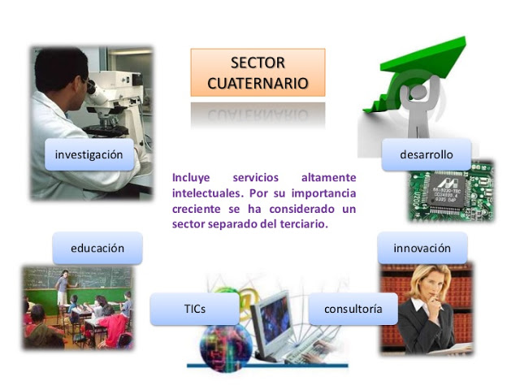

# 1.1. Nuestro Sector Productivo: Informática y Comunicaciones 💻

---

## Introducción

El sector de la **informática y las comunicaciones** es uno de los más dinámicos e innovadores en la economía global. Este sector no solo impulsa el desarrollo tecnológico, sino que también tiene un impacto significativo en la sostenibilidad y en el cumplimiento de los Objetivos de Desarrollo Sostenible (ODS).

---

## Características del Sector

- **Innovación constante**: Desarrollo de nuevas tecnologías como la inteligencia artificial, el big data y el Internet de las cosas (IoT).
- **Conectividad global**: Facilitación de la comunicación y el acceso a la información en todo el mundo.
- **Impacto transversal**: Influencia en otros sectores productivos, como la salud, la educación y la industria.

---

## Contribución a la Sostenibilidad

El sector de la informática y las comunicaciones puede contribuir a la sostenibilidad a través de:

- **Tecnologías verdes**: Desarrollo de hardware y software eficientes energéticamente.
- **Digitalización de procesos**: Reducción del uso de papel y optimización de recursos.
- **Educación y concienciación**: Uso de plataformas digitales para promover prácticas sostenibles.

---

## Infografía del Sector

---

## Enlaces de Interés

- [Impacto de la tecnología en la sostenibilidad](https://www.dogoodpeople.com/es/tendencias-rsc/tecnologia-sostenible/tecnologia-sostenible-su-contribucion-desarrollo-sostenible/)
- [Información sobre el sector TIC](https://www.eustat.eus/documentos/elem_12878/definicion.html)

---

### Navegación

[Anterior](./1_aspectos_sostenibilidad_carrero.md) [Siguiente](./1.2_ods_relevantes_carrero.md)

[INDICE](../indice.md)
