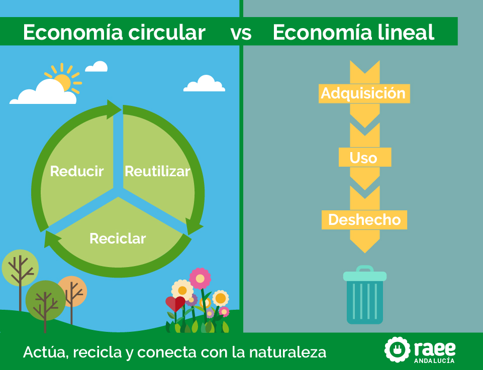

# 5.1. Economía Lineal vs. Economía Circular: Comparación y Transiciones Clave 🔄

---

## Introducción

El modelo económico tradicional, conocido como **economía lineal**, se basa en un enfoque de "tomar, hacer, desechar". En contraste, la **economía circular** promueve un sistema regenerativo donde los recursos se mantienen en uso el mayor tiempo posible, minimizando los residuos. A continuación, se presenta una comparación detallada entre ambos modelos.

---

## Comparación: Economía Lineal vs. Economía Circular

| Característica        | Economía Lineal 📉                       | Economía Circular 🔄                         |
| --------------------- | ---------------------------------------- | -------------------------------------------- |
| **Enfoque**           | Extraer, producir, consumir, desechar.   | Reducir, reutilizar, reciclar, regenerar.    |
| **Uso de recursos**   | Uso intensivo y agotamiento de recursos. | Uso eficiente y sostenible de recursos.      |
| **Residuos**          | Generación masiva de residuos.           | Minimización de residuos y valorización.     |
| **Impacto ambiental** | Alto impacto (contaminación, emisiones). | Bajo impacto (sostenibilidad, regeneración). |
| **Modelo económico**  | Corto plazo, maximización de beneficios. | Largo plazo, equilibrio económico-ambiental. |

---

## Transiciones Clave hacia la Economía Circular

### 1. Diseño Sostenible 🎨

- **Descripción**: Productos diseñados para ser duraderos, reparables y reciclables.
- **Ejemplo**: Uso de materiales biodegradables o reciclados en la fabricación.

### 2. Modelos de Negocio Circulares 💼

- **Descripción**: Implementación de sistemas de alquiler, reutilización y reciclaje.
- **Ejemplo**: Empresas que ofrecen servicios de reparación y actualización de dispositivos.

### 3. Innovación Tecnológica 🛠️

- **Descripción**: Desarrollo de tecnologías para la recuperación y reutilización de materiales.
- **Ejemplo**: Uso de inteligencia artificial para optimizar el reciclaje.

---

## Cita Inspiradora

> _"La economía circular no es solo una opción, es una necesidad para garantizar un futuro sostenible."_ – Ellen MacArthur.

---

---

### Navegación

[Anterior](./5_economia_verde_circular_carrero.md) [Siguiente](./5.2_economia_verde_y_azul_carrero.md)

[INDICE](../indice.md)
