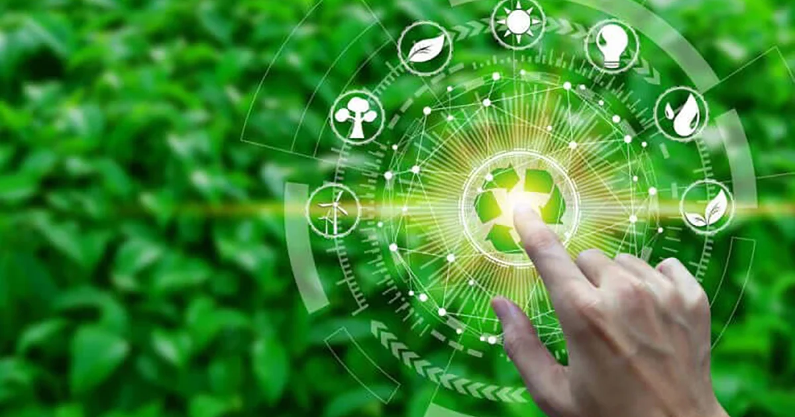
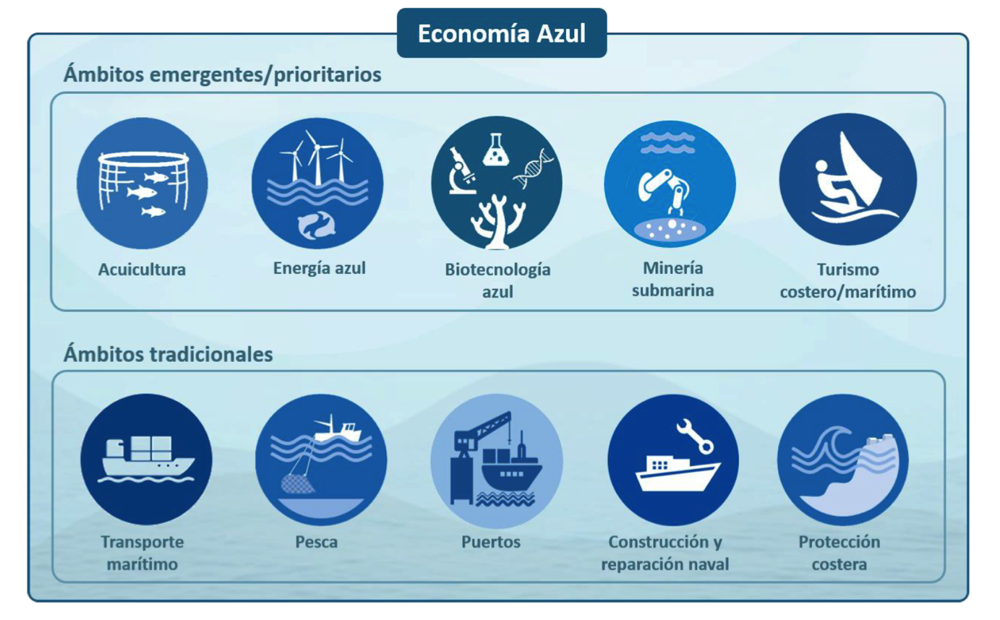

# 5.2. Economía Verde y Azul frente al Modelo Clásico 🌿🌊

---

## Introducción

La **economía verde** y la **economía azul** son dos enfoques innovadores que buscan redefinir el modelo económico clásico, incorporando principios de sostenibilidad y respeto por los ecosistemas. A continuación, se exploran sus características y diferencias con el modelo tradicional.

---

## Economía Verde 🌿

### Definición

La economía verde se centra en la reducción del impacto ambiental mediante la promoción de energías renovables, la eficiencia energética y la conservación de los recursos naturales.

### Principales Características

- **Energías renovables**: Uso de fuentes como la solar, eólica e hidroeléctrica.
- **Conservación de ecosistemas**: Protección de bosques, ríos y biodiversidad.
- **Empleos verdes**: Creación de puestos de trabajo en sectores sostenibles.

---

## Economía Azul 🌊

### Definición

La economía azul se enfoca en la sostenibilidad de los océanos y los recursos marinos, promoviendo actividades económicas que respeten y preserven los ecosistemas acuáticos.

### Principales Características

- **Pesca sostenible**: Prácticas que evitan la sobrepesca y protegen las especies marinas.
- **Turismo responsable**: Desarrollo turístico que minimiza el impacto en los océanos.
- **Energía marina**: Explotación de energías como la eólica marina y la undimotriz.

---

## Comparación con el Modelo Clásico

| Característica        | Modelo Clásico 📊                  | Economía Verde 🌿          | Economía Azul 🌊                  |
| --------------------- | ---------------------------------- | -------------------------- | --------------------------------- |
| **Enfoque**           | Maximización de beneficios.        | Sostenibilidad ambiental.  | Sostenibilidad de los océanos.    |
| **Recursos**          | Explotación intensiva.             | Uso eficiente y renovable. | Conservación de recursos marinos. |
| **Impacto ambiental** | Alto (contaminación, agotamiento). | Bajo (energías limpias).   | Bajo (protección de ecosistemas). |
| **Innovación**        | Tecnologías tradicionales.         | Tecnologías verdes.        | Tecnologías azules.               |

---

## Cita Inspiradora

> _"El futuro depende de lo que hagamos hoy para proteger nuestros recursos naturales y ecosistemas."_ – Jane Goodall.

---

### Navegación

[Anterior](./5.1_economia_lineal_vs_circular_carrero.md) [INDICE](../indice.md)
