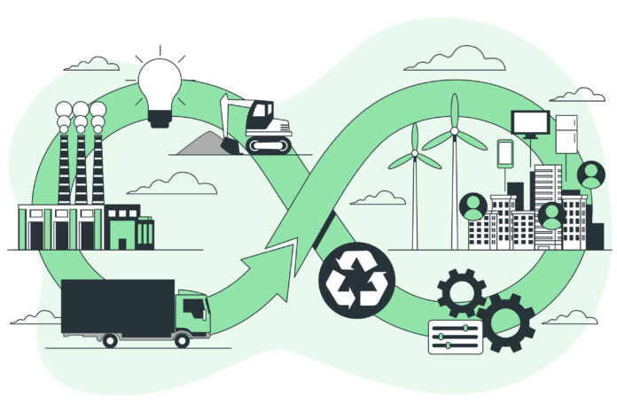

# 5. Principios de la Economía Verde y Circular 🌿🔄

---

## Introducción

La **economía verde** y la **economía circular** son dos enfoques complementarios que buscan transformar el modelo económico tradicional hacia uno más sostenible y respetuoso con el medio ambiente. A continuación, se exploran los principios fundamentales de ambos modelos.

---

## Economía Verde 🌿

### Definición

La economía verde se centra en la reducción del impacto ambiental mediante la promoción de prácticas sostenibles en todos los sectores económicos. Su objetivo es lograr un equilibrio entre el crecimiento económico, el bienestar social y la protección del medio ambiente.

### Principios Fundamentales

1. **Uso de energías renovables**: Promoción de fuentes de energía como la solar, eólica e hidroeléctrica.
2. **Eficiencia energética**: Optimización del uso de energía en procesos industriales y domésticos.
3. **Conservación de recursos naturales**: Protección de bosques, ríos, océanos y biodiversidad.
4. **Empleos verdes**: Creación de puestos de trabajo en sectores sostenibles, como las energías renovables y la agricultura ecológica.
5. **Reducción de emisiones**: Implementación de tecnologías y prácticas que minimicen las emisiones de gases de efecto invernadero.

---

## Economía Circular 🔄

### Definición

La economía circular es un modelo económico que busca mantener los recursos en uso el mayor tiempo posible, minimizando los residuos y fomentando la regeneración de los sistemas naturales. Se basa en tres principios clave: reducir, reutilizar y reciclar.

### Principios Fundamentales

1. **Diseño sostenible**: Creación de productos duraderos, reparables y reciclables.
2. **Reducción de residuos**: Minimización de la generación de residuos mediante la reutilización y el reciclaje.
3. **Regeneración de recursos**: Uso de materiales biodegradables y regeneración de ecosistemas.
4. **Modelos de negocio circulares**: Implementación de sistemas de alquiler, reparación y reutilización.
5. **Innovación tecnológica**: Desarrollo de tecnologías para la recuperación y reutilización de materiales.

---

## Comparación entre Economía Verde y Circular

| Característica        | Economía Verde 🌿                | Economía Circular 🔄                  |
| --------------------- | -------------------------------- | ------------------------------------- |
| **Enfoque**           | Reducción del impacto ambiental. | Mantenimiento de recursos en uso.     |
| **Recursos**          | Uso eficiente y renovable.       | Reducción, reutilización y reciclaje. |
| **Impacto ambiental** | Bajo (energías limpias).         | Bajo (minimización de residuos).      |
| **Innovación**        | Tecnologías verdes.              | Tecnologías circulares.               |
| **Objetivo**          | Equilibrio económico-ambiental.  | Regeneración de sistemas naturales.   |

---

## Cita Inspiradora

> _"La economía circular no es solo una opción, es una necesidad para garantizar un futuro sostenible."_ – Ellen MacArthur.

---

## Economía Verde y Circular

---

## Enlaces de Interés

- [Fundación Ellen MacArthur](https://www.ellenmacarthurfoundation.org/)
- [Programa de las Naciones Unidas para el Medio Ambiente](https://www.unep.org/)

---

### Navegación

[ÍNDICE](../indice.md) [Siguiente](5.1_economia_lineal_vs_circular_carrero.md)
