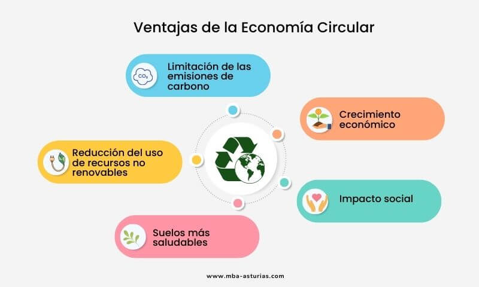

# 6. Beneficios de la Economía Verde y Circular 🌍 [Volver al Índice](../indice_pisa3_C_manso.md)

La transición hacia una **economía verde y circular** es una prioridad para España, no solo por su compromiso con la *Agenda 2030*, sino también por los desafíos específicos que enfrenta el país. Este modelo, que promueve la sostenibilidad y la eficiencia en el uso de recursos, contrasta con el enfoque lineal tradicional (*extraer, producir, consumir y desechar*). A continuación, se exploran los beneficios económicos, sociales y ambientales de este cambio.

---

[Ir a la página siguiente](./6.1_beneficios_economicos_manso.md)

[Volver al índice](../indice_pisa3_C.md)

---
