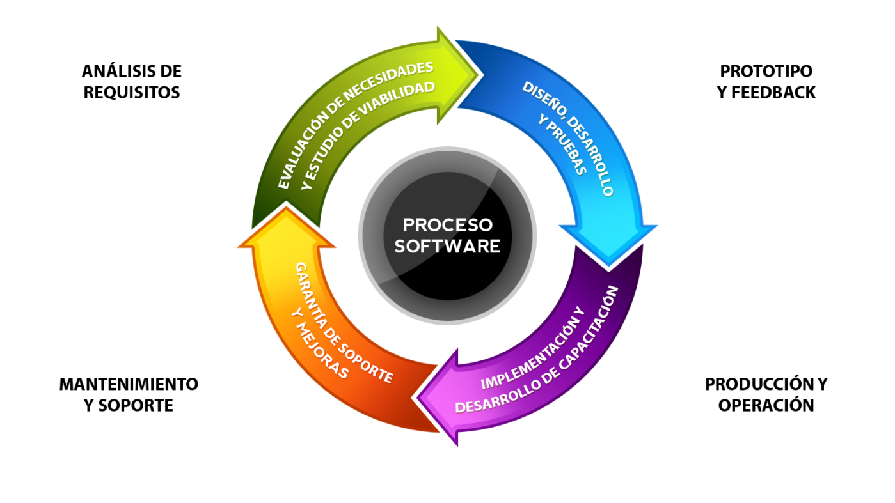

# 8.2. Exploración del Ciclo de Vida en Productos Lógicos (Software) 💻

---

## Introducción

El **ciclo de vida del software** se refiere a las etapas por las que pasa un producto lógico desde su concepción hasta su retirada. A diferencia del hardware, el software no tiene un impacto físico directo, pero su desarrollo y uso pueden tener implicaciones significativas en términos de sostenibilidad.

---

## Fases Principales del Ciclo de Vida del Software

### 1. Planificación y Análisis 📊

- **Descripción**: Definición de requisitos y planificación del proyecto.
- **Sostenibilidad**: Uso de metodologías ágiles para reducir el desperdicio de recursos.

### 2. Diseño y Desarrollo 🛠️

- **Descripción**: Creación del software y diseño de la arquitectura.
- **Sostenibilidad**: Optimización del código para reducir el consumo energético.

### 3. Pruebas y Implementación 🧪

- **Descripción**: Verificación del software y despliegue en producción.
- **Sostenibilidad**: Uso de entornos de pruebas virtualizados para ahorrar recursos.

### 4. Mantenimiento y Actualizaciones 🔄

- **Descripción**: Corrección de errores y mejora del software.
- **Sostenibilidad**: Implementación de actualizaciones eficientes y compatibles.

### 5. Retirada 🛑

- **Descripción**: Descontinuación del software.
- **Sostenibilidad**: Migración de datos y reutilización de componentes en nuevos proyectos.

---

## Tabla de Fases y Sostenibilidad

| Fase                            | Descripción                   | Acciones Sostenibles                           |
| ------------------------------- | ----------------------------- | ---------------------------------------------- |
| Planificación y Análisis        | Definición de requisitos.     | Metodologías ágiles para reducir desperdicios. |
| Diseño y Desarrollo             | Creación del software.        | Optimización del código para eficiencia.       |
| Pruebas e Implementación        | Verificación y despliegue.    | Uso de entornos virtualizados.                 |
| Mantenimiento y Actualizaciones | Corrección y mejora.          | Actualizaciones eficientes y compatibles.      |
| Retirada                        | Descontinuación del software. | Migración de datos y reutilización.            |

---

## Cita Inspiradora

> _"El software es como la arquitectura: debe ser funcional, eficiente y sostenible."_ – Grady Booch.

---

## Ciclo de Vida del Software

---

## Enlaces de Interés

- [Desarrollo Sostenible de Software](https://killky.com/desarrollo-de-software-sostenible/)

---

### Navegación

[Anterior](./8.1_ciclo_vida_hardware_carrero.md) [ÍNDICE](../indice.md)
