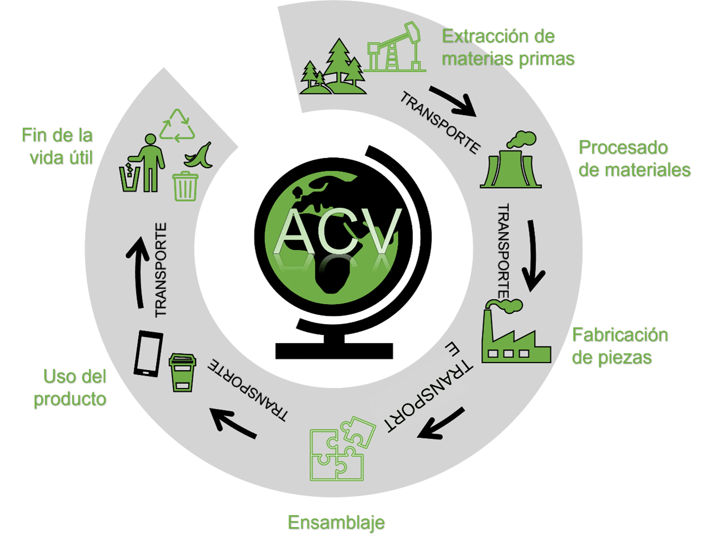

# 8. Ciclo de Vida de los Productos: Análisis y Sostenibilidad ♻️

---

## Introducción

El **ciclo de vida de los productos** es un concepto clave para entender el impacto ambiental de los bienes que consumimos. Analizar cada fase del ciclo de vida permite identificar oportunidades para mejorar la sostenibilidad y reducir el impacto negativo en el medio ambiente. Este análisis se aplica tanto a productos físicos (hardware) como a productos lógicos (software).

---

## 8.1. Ciclo de Vida de Productos Tradicionales (Hardware)

### Concepto

El ciclo de vida del hardware se refiere a las etapas por las que pasa un producto físico, desde su diseño y producción hasta su disposición final. Cada fase tiene implicaciones ambientales, económicas y sociales.

### Fases Principales

1. **Diseño y Desarrollo** 🎨

   - **Descripción**: Creación del concepto y diseño del producto.
   - **Sostenibilidad**: Uso de materiales reciclables y diseño modular para facilitar la reparación.

2. **Producción** 🏭

   - **Descripción**: Fabricación del producto.
   - **Sostenibilidad**: Implementación de procesos de producción eficientes y uso de energías renovables.

3. **Distribución** 🚚

   - **Descripción**: Transporte del producto a los puntos de venta.
   - **Sostenibilidad**: Optimización de rutas y uso de vehículos de bajas emisiones.

4. **Uso** 🏠

   - **Descripción**: Utilización del producto por parte del consumidor.
   - **Sostenibilidad**: Promoción de prácticas de uso eficiente y mantenimiento adecuado.

5. **Fin de Vida** ♻️
   - **Descripción**: Disposición final del producto.
   - **Sostenibilidad**: Reciclaje y reutilización de componentes.

---

## 8.2. Exploración del Ciclo de Vida en Productos Lógicos (Software)

### Concepto

El ciclo de vida del software se refiere a las etapas por las que pasa un producto lógico, desde su concepción hasta su retirada. Aunque no tiene un impacto físico directo, su desarrollo y uso pueden tener implicaciones significativas en términos de sostenibilidad.

### Fases Principales

1. **Planificación y Análisis** 📊

   - **Descripción**: Definición de requisitos y planificación del proyecto.
   - **Sostenibilidad**: Uso de metodologías ágiles para reducir el desperdicio de recursos.

2. **Diseño y Desarrollo** 🛠️

   - **Descripción**: Creación del software y diseño de la arquitectura.
   - **Sostenibilidad**: Optimización del código para reducir el consumo energético.

3. **Pruebas e Implementación** 🧪

   - **Descripción**: Verificación del software y despliegue en producción.
   - **Sostenibilidad**: Uso de entornos de pruebas virtualizados para ahorrar recursos.

4. **Mantenimiento y Actualizaciones** 🔄

   - **Descripción**: Corrección de errores y mejora del software.
   - **Sostenibilidad**: Implementación de actualizaciones eficientes y compatibles.

5. **Retirada** 🛑
   - **Descripción**: Descontinuación del software.
   - **Sostenibilidad**: Migración de datos y reutilización de componentes en nuevos proyectos.

---

## Tabla Comparativa: Ciclo de Vida de Hardware vs. Software

| Fase             | Hardware 🖥️                                   | Software 💻                           |
| ---------------- | --------------------------------------------- | ------------------------------------- |
| **Diseño**       | Uso de materiales reciclables.                | Optimización del código.              |
| **Producción**   | Procesos eficientes y energías renovables.    | Desarrollo en entornos virtualizados. |
| **Distribución** | Optimización de rutas y vehículos eficientes. | Despliegue en la nube.                |
| **Uso**          | Prácticas de uso eficiente.                   | Actualizaciones y mantenimiento.      |
| **Fin de Vida**  | Reciclaje y reutilización.                    | Migración de datos y reutilización.   |

---

## Cita Inspiradora

> _"El diseño sostenible no es una opción, es una responsabilidad."_ – William McDonough.

---

## Ciclo de Vida de Productos

---

## Enlaces de Interés

- [Guía de Diseño Sostenible](https://www.ejemplo.com)
- [Desarrollo Sostenible de Software](https://www.ejemplo.com)

---

### Navegación

[ÍNDICE](../indice.md) [Siguiente](./8.1_ciclo_vida_hardware_carrero.md)
